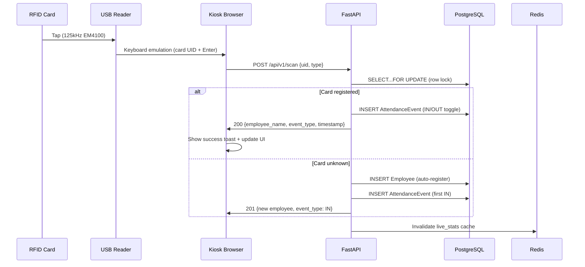
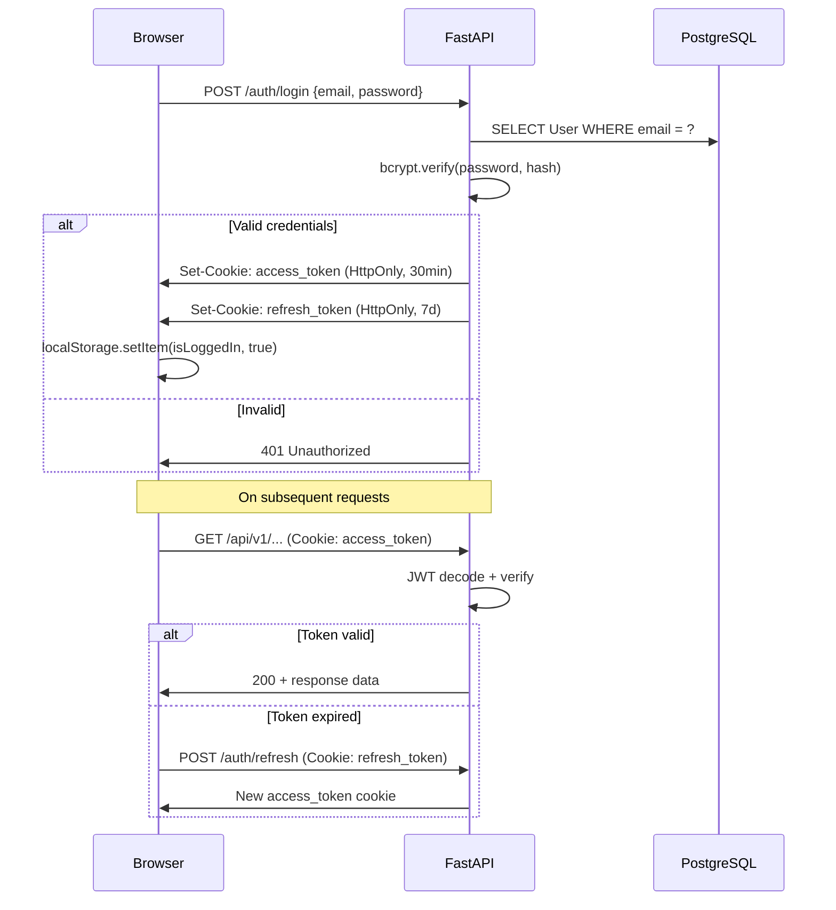
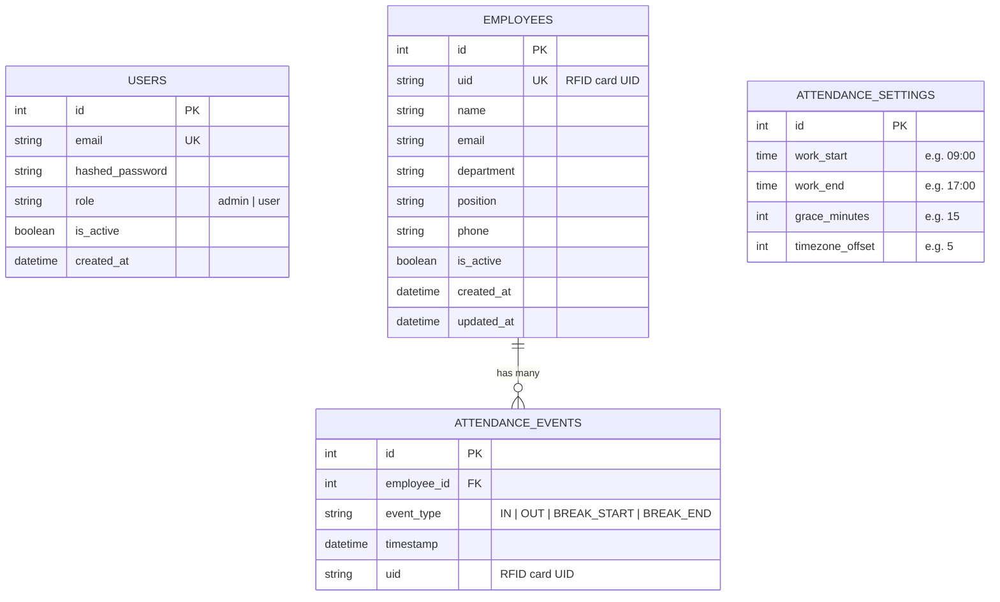

# 🏗️ Architecture

## System Overview

Sentinel is a 4-tier architecture deployed as Docker containers behind an Nginx reverse proxy.

```
                    ┌─────────────────────────────────────────────────┐
                    │                 INTERNET                        │
                    └──────────────────┬──────────────────────────────┘
                                       │ HTTPS :443
                    ┌──────────────────▼──────────────────────────────┐
                    │              Nginx (Alpine)                     │
                    │  • TLS termination (Let's Encrypt)              │
                    │  • Rate limiting (5r/m login, 100r/m API)       │
                    │  • Gzip compression (level 4)                   │
                    │  • Static file serving (/frontend/*)            │
                    │  • Proxy pass → FastAPI :8000                   │
                    └──────┬──────────────────────┬───────────────────┘
                           │ /api/v1/*            │ /*.html, /css, /js
                    ┌──────▼──────────┐    ┌──────▼───────────┐
                    │   FastAPI App   │    │  Static Files    │
                    │   (Uvicorn)     │    │  (Nginx direct)  │
                    │   :8000         │    └──────────────────┘
                    │                 │
                    │  ┌───────────┐  │
                    │  │ Endpoints │  │
                    │  │ auth.py   │  │
                    │  │ employees │  │
                    │  │ reports   │  │
                    │  └─────┬─────┘  │
                    │        │        │
                    │  ┌─────▼─────┐  │
                    │  │  Service  │  │
                    │  │  Layer    │  │
                    │  │ (deps.py) │  │
                    │  └──┬────┬───┘  │
                    └─────┼────┼──────┘
                          │    │
               ┌──────────▼┐  ┌▼──────────┐
               │ PostgreSQL │  │  Redis 7   │
               │    16      │  │  (cache)   │
               │  (asyncpg) │  │ 15s TTL    │
               │  :5432     │  │ :6379      │
               └────────────┘  └────────────┘
```

---

## Component Architecture

### Backend (FastAPI)

```
app/
├── main.py                    # App factory, lifespan, exception handlers
├── api/v1/
│   ├── api.py                 # Router aggregation
│   ├── deps.py                # Dependency injection (DB session, auth)
│   └── endpoints/
│       ├── auth.py            # Login, refresh, logout, user mgmt
│       ├── employees.py       # RFID scan, employee CRUD, breaks
│       └── reports.py         # Reports, analytics, CSV export
├── core/
│   ├── config.py              # pydantic-settings (env vars → typed config)
│   ├── security.py            # JWT create/verify, bcrypt hash/verify
│   └── exceptions.py          # Global HTTPException handlers
├── models/
│   ├── user.py                # User ORM (admin accounts)
│   ├── employee.py            # Employee ORM (RFID card holders)
│   └── attendance.py          # AttendanceEvent ORM
├── schemas/
│   ├── user.py                # User request/response schemas
│   ├── employee.py            # Employee schemas
│   └── attendance.py          # Attendance + report schemas
└── db/
    ├── base.py                # DeclarativeBase
    └── session.py             # AsyncSession factory
```

### Frontend (Vanilla JS)

```
frontend/
├── index.html                 # Kiosk — RFID scan interface
├── login.html                 # Admin login page
├── admin.html                 # Dashboard with live stats
├── employees.html             # Employee CRUD management
├── register.html              # New employee registration
├── reports.html               # Reports & analytics
├── settings.html              # System configuration
├── css/
│   └── main.css               # 1,100+ line design system
└── js/
    ├── script.js              # Kiosk logic (RFID capture, scan processing)
    ├── auth.js                # Auth guard, token refresh, fetch wrapper
    ├── layout.js              # Sidebar, header, page transitions
    └── toast.js               # Global notification system
```

---

## Data Flow

### RFID Scan Flow



### Authentication Flow



---

## Database Schema



---

## Technology Choices

| Decision | Choice | Rationale |
|----------|--------|-----------|
| **Language** | Python 3.12 | Async support, FastAPI ecosystem, rapid development |
| **Framework** | FastAPI | Async-native, auto-generated OpenAPI docs, Pydantic validation |
| **ORM** | SQLAlchemy 2.0 (async) | Mature, type-safe, excellent PostgreSQL support |
| **Database** | PostgreSQL 16 | Row-level locking, JSONB, reliability, free |
| **Cache** | Redis 7 | Sub-millisecond reads, TTL support, pub/sub ready |
| **Proxy** | Nginx | Rate limiting, gzip, TLS, static files, battle-tested |
| **Auth** | JWT (HttpOnly cookies) | Stateless, no CSRF for same-site, XSS-resistant |
| **Frontend** | Vanilla JS | Zero build step, instant load, no framework overhead |
| **Container** | Docker Compose | Reproducible deploys, service isolation, easy scaling |
| **RFID** | 125kHz EM4100 USB HID | $6 readers, no drivers, keyboard emulation mode |

---

## Scalability Considerations

### Current Capacity (Single Server)

| Metric | Capacity |
|--------|----------|
| Concurrent users | ~500 |
| Scans per second | ~100 |
| Database size (1 year, 500 employees) | ~500 MB |
| Response time (p95) | <50ms |

### Scaling Path

1. **Vertical:** Increase server CPU/RAM (handles up to ~2,000 employees)
2. **Read replicas:** PostgreSQL streaming replication for report queries
3. **Redis cluster:** For multi-location cache synchronization
4. **Horizontal:** Multiple FastAPI workers behind Nginx load balancer
5. **CDN:** Cloudflare/CloudFront for static assets

---

[← Back to README](README.md)
